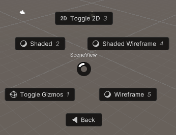
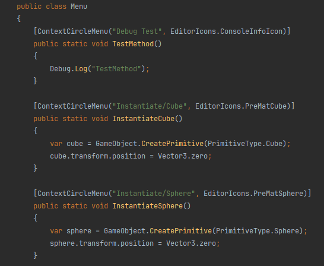
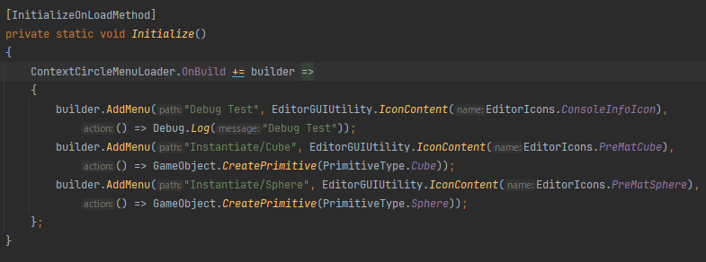

# Context Circle Menu

Context Circle Menu is Unity tool that allows users to open a circular menu in the Scene view to quickly execute user-defined methods, enhancing workflow efficiency.


[](LICENSE)


## Overview

Context Circle Menu is a simple open-source tool for Unity. It lets users open a circular menu in the Scene view or as a standalone VisualElement. This menu makes it easy to quickly use your own methods, helping you work faster by avoiding complex menus. Perfect for developers wanting to manage their scenes better and save time, Context Circle Menu is flexible and easy to use.

[](https://gyazo.com/8124142a3643fb0d735f7dd66b068142)

[](https://gyazo.com/8256a41b2b0f7f73d98e6f6af0f94479)

### Feature

-   Create Context Circle Menu



-   Easy to use Editor Icon

-   Customized Menu

    -   Add from Attribute

    

    -   Add Manual

    

-   Open in Scene View
-   Customized Shortcut Key


## Table of Contents
- [Context Circle Menu](#context-circle-menu)
  - [Overview](#overview)
    - [Feature](#feature)
  - [Table of Contents](#table-of-contents)
  - [Setup](#setup)
    - [Requirements](#requirements)
    - [Installation](#installation)
  - [Demonstration](#demonstration)
  - [Editor Icons](#editor-icons)
  - [Customized Menu](#customized-menu)
    - [Manual Add Method](#manual-add-method)
    - [Customized Button](#customized-button)
  - [Customized Shortcut Key](#customized-shortcut-key)
  - [LISENCE](#lisence)
  - [AUTHOR](#author)

## Setup

### Requirements

-   Unity 2022.3 or higher

### Installation

1. select Window > Package Manager
2. Select the "+" button > Add package from git URL
3. Enter the following URL

```
https://github.com/Garume/Context-Circle-Menu.git?path=/Assets/ContextCicleMenu
```

Or open Packages/manifest.json and add the following to the dependencies block

```
{
    "dependencies": {
        "com.garume.context-circle-menu": "https://github.com/Garume/Context-Circle-Menu.git?path=/Assets/ContextCicleMenu"
    }
}
```

## Demonstration

Just apply the `Context Circle Menu` attribute to the static method you wish to add.

```cs
public class Menu
{
    [ContextCircleMenu("Debug Test")]
    public static void TestMethod()
    {
        Debug.Log("TestMethod");
    }
}
```

Then you will see below menu.

Press the `A` key on the scene view.

[](https://gyazo.com/1ec027f73700f52c6b3cd9691647a8a1)

If you want to create folders, separate them with `/`.

```cs
public class Menu
{
    [ContextCircleMenu("Example/Debug Test")]
    public static void TestMethod()
    {
        Debug.Log("TestMethod");
    }
}
```

Then you will see below menu.

[](https://gyazo.com/39b665e8fdd473bb408102e1b5d5bf09)

## Editor Icons

Icons can be attached to menu buttons.

The `EditorIcons` class is provided as a utility to add icon easily.

To add an icon, do the below.

```cs
[ContextCircleMenu("Debug Test", EditorIcons.ConsoleInfoIcon)]
public static void TestMethod()
{
    Debug.Log("TestMethod");
}
```

## Customized Menu

### Manual Add Method

If you do not want to use the `Context Circle Menu` attribute, you can register the method manually.

The process of registering methods internally can be hooked.

```cs
public class Menu
{
    [InitializeOnLoadMethod]
    private static void Initialize()
    {
        ContextCircleMenuLoader.OnBuild += (builder =>
        {
            builder.AddMenu("Debug Test", EditorGUIUtility.IconContent(EditorIcons.ConsoleInfoIcon), () => Debug.Log("Debug Test"));
            builder.AddMenu("Instantiate/Cube", EditorGUIUtility.IconContent(EditorIcons.PreMatCube), ()=> GameObject.CreatePrimitive(PrimitiveType.Cube));
            builder.AddMenu("Instantiate/Sphere", EditorGUIUtility.IconContent(EditorIcons.PreMatSphere), ()=> GameObject.CreatePrimitive(PrimitiveType.Sphere));
        });
    }
}
```

### Customized Button

If you don't like the button UI, you can replace it with your own.

Use `builder.ConfigureFolder();`

> [!CAUTION]
> It is an incomplete feature.
> 
> Destructive changes may be made.

First, you need to create a FolderMenu that extends `CircleMenu`.
You can create buttons freely in `CreateButtons`.
Please refer to `FolderCircleMenu.cs` for detailed code.

Next, create a FolderMenuFactory that implements `IFolderCircleMenuFactory`.
Please refer to `CircleMenuFactory` for detailed code.

Finally, you can replace the UI by doing the below.

```cs
ContextCircleMenuLoader.OnBuild += (builder =>
{
    ...
    builder.ConfigureFolder(FolderMenuFactory);
});
```

## Customized Shortcut Key

The default menu open/close button is set to the `A` key, but can be changed freely.

`Edit > Shortcuts` to open a window.

Search for `Context Circle Menu` and you will find the settings as shown in the figure below.


Set the keys as you like.

## LISENCE

MIT

## AUTHOR

@Garume
