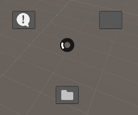

# Context Circle Menu

Context Circle Menu is Unity tool that allows users to open a circular menu in the Scene view to quickly execute user-defined methods, enhancing workflow efficiency.


[](LICENSE)


[日本語版](https://github.com/Garume/ContextCircleMenu/blob/master/README_JA.md)

## Overview

Context Circle Menu is a simple open-source tool for Unity. It lets users open a circular menu in the Scene view or as a standalone VisualElement. This menu makes it easy to quickly use your own methods, helping you work faster by avoiding complex menus. Perfect for developers wanting to manage their scenes better and save time, Context Circle Menu is flexible and easy to use.

[](https://gyazo.com/8124142a3643fb0d735f7dd66b068142)

[](https://gyazo.com/8256a41b2b0f7f73d98e6f6af0f94479)

### Feature

-   Create Context Circle Menu
-   Easy to use Editor Icon
-   Customized Menu
    -   Add from Attribute
    -   Add Manual
    -   Button design
    -   Folder design
-   Open in Scene View
-   Customized Shortcut Key

## Table of Contents
- [Context Circle Menu](#context-circle-menu)
  - [Overview](#Overview)
    - [Features](#Features)
  - [Table of Contents](#Table-of-Contents)
  - [Setup](#Setup)
    - [Requirements](#Requirements)
    - [Installation](#Installation)
  - [Demonstration](#Demonstration)
    - [Editor Icons](#editor-icons)
    - [Add Manual Method](#Add-Manual-Method)
  - [Customize](#Customize) 
    - [Customize Buttons](#Customize-Buttons)
    - [Customize Folder](#Customize-Folder)
    - [Customize Shortcut](#Customized-Shortcut-Key)
  - [API Documentation](#API-Documentation)
  - [LISENCE](#lisence)
  - [AUTHOR](#author)

## Setup

### Requirements

-   Unity 2022.3 or higher

### Installation

1. select Window > Package Manager
2. Select the "+" button > Add package from git URL
3. Enter the following URL

```
https://github.com/Garume/ContextCircleMenu.git?path=/Assets/ContextCircleMenu
```

Or open Packages/manifest.json and add the following to the dependencies block

```
{
    "dependencies": {
        "com.garume.context-circle-menu": "https://github.com/Garume/ContextCircleMenu.git?path=/Assets/ContextCircleMenu"
    }
}
```

## Demonstration

Just apply the `Context Circle Menu` attribute to the static method you wish to add.

```cs
public class Menu
{
    [ContextCircleMenu("Debug Test")]
    public static void TestMethod()
    {
        Debug.Log("TestMethod");
    }
}
```

Then you will see below menu.

Press the `A` key on the scene view.

[](https://gyazo.com/1ec027f73700f52c6b3cd9691647a8a1)

If you want to create folders, separate them with `/`.

```cs
public class Menu
{
    [ContextCircleMenu("Example/Debug Test")]
    public static void TestMethod()
    {
        Debug.Log("TestMethod");
    }
}
```

Then you will see below menu.

[](https://gyazo.com/39b665e8fdd473bb408102e1b5d5bf09)

### Editor Icons

Icons can be attached to menu buttons.

The `EditorIcons` class is provided as a utility to add icon easily.

To add an icon, do the below.

```cs
[ContextCircleMenu("Debug Test", EditorIcons.ConsoleInfoIcon)]
public static void TestMethod()
{
    Debug.Log("TestMethod");
}
```
### Manual Add Method

If you do not want to use the `Context Circle Menu` attribute, you can register the method manually.

The process of registering methods internally can be hooked.

```cs
public class Menu
{
    [InitializeOnLoadMethod]
    private static void Initialize()
    {
        ContextCircleMenuLoader.OnBuild += (builder =>
        {
            builder.AddMenu("Debug Test", EditorGUIUtility.IconContent(EditorIcons.ConsoleInfoIcon), () => Debug.Log("Debug Test"));
            builder.AddMenu("Instantiate/Cube", EditorGUIUtility.IconContent(EditorIcons.PreMatCube), ()=> GameObject.CreatePrimitive(PrimitiveType.Cube));
            builder.AddMenu("Instantiate/Sphere", EditorGUIUtility.IconContent(EditorIcons.PreMatSphere), ()=> GameObject.CreatePrimitive(PrimitiveType.Sphere));
        });
    }
}
```

## Customization

### Customized Button

If you don't like the UI of the button, you can replace it with your own button.

Use `builder.ConfigureButton` in `ContextCircleMenuLoader.OnBuild`.

```cs
ContextCircleMenuLoader.OnBuild += (builder =>
{
    ...
    builder.ConfigureButton(FolderMenuFactory);
});
```

To create your own button, you must create a class that extends CircleButton and a corresponding Factory class.

Here is an example code similar to the one provided in Sample's Custom.

Samples can be imported from Package Manager > ContextCircleMenu > Samples.

In this example, the button is replaced with a button that displays only an icon.

Create the following class

```cs
public class CustomButtonFactory : IButtonFactory
{
    public CircleButton Create(string path, GUIContent icon, Action onSelected, int section)
    {
        return new OnlyImageCircleButton(path, icon, section, onSelected);
    }

    // Back button is needed when creating a folder structure menu.
    // section should be -1 unless ConfigureFolder is used.
    public CircleButton CreateBackButton(Action onBack)
    {
        return new OnlyImageCircleButton("Back", EditorGUIUtility.IconContent(EditorIcons.Back2x),
            -1, onBack);
    }
}

public class OnlyImageCircleButton : CircleButton
{
    public OnlyImageCircleButton(string text, GUIContent icon, int section, Action onSelect) : base(text, icon, section, onSelect)
    {
    }

    // You can edit the generated buttons.
    // Feel free to customize the buttons here.
    protected override void ModifierButton(Button button, string text, GUIContent icon, int section)
    {
        var image = new Image
        {
            image = icon.image,
            style =
            {
                width = 32f,
                height = 32f,
                flexShrink = 0
            },
            tooltip = text
        };

        button.Add(image);
    }
}

```

Set the created Factory class.

```cs
ContextCircleMenuLoader.OnBuild += (builder =>
{
    ...
    builder.ConfigureButton(new CustomButtonFactory());
});
```

It will then be replaced by a button that displays only the icon as shown below.



### Customize Folder

If you don't like the folder UI, you can replace it with your own folder.

```cs
ContextCircleMenuLoader.OnBuild += (builder =>
{
    ...
    builder.ConfigureFolder(FolderMenuFactory);
});
```

> [!CAUTION]
> Destructive changes were made in v1.0.0.

To create your own folder, you need to create a class that extends FolderCircleMenu and a corresponding Factory class.


Here is an example code similar to the one provided in Sample's Custom.

Samples can be imported from Package Manager > ContextCircleMenu > Samples.

In this example, we are replacing an existing UI with vector graphics.

Create the following classes

```cs
public class CustomFolderMenuFactory : IFolderCircleMenuFactory
{
    public FolderCircleMenu Create(string path, IMenuControllable menu, CircleMenu parent, IButtonFactory factory)
    {
        return new CustomFolderCircleMenu(path, menu, parent, factory);
    }
}

public class CustomFolderCircleMenu : FolderCircleMenu
{
    public CustomFolderCircleMenu(string path, IMenuControllable menu, CircleMenu parent, IButtonFactory factory) :
        base(path, menu, EditorGUIUtility.IconContent(EditorIcons.FolderIcon), parent, factory)
    {
    }

    protected override VisualElement[] CreateUtilityElements(ref ContextCircleMenuOption menuOption)
    {
        var element = new VisualElement();
        var option = menuOption;
        element.generateVisualContent += context =>
        {
            var painter = context.painter2D;
            var buttonCount = ButtonElements.Length;
            for (var i = 0; i < buttonCount; i++)
            {
                var angle = (float)i / buttonCount * 360f;
                if (buttonCount % 2 == 1)
                    angle += 180f;
                else
                    angle += 180f - 360f / buttonCount / 2;
                var vector = new Vector2(
                    Mathf.Sin(Mathf.Deg2Rad * angle),
                    Mathf.Cos(Mathf.Deg2Rad * angle)).normalized;

                var from = vector * 12f;
                var to = vector * option.Radius * 1.5f;
                painter.strokeColor = Color.black;
                painter.lineWidth = 2f;
                painter.BeginPath();
                painter.MoveTo(from);
                painter.LineTo(to);
                painter.Stroke();
            }

            painter.BeginPath();
            painter.Arc(Vector2.zero, option.Radius * 1.5f, 0, 360f);
            painter.fillColor = new Color(0f, 0f, 0f, 0.2f);
            painter.Fill();

            painter.DrawCircle(Vector2.zero, option.Radius * 1.5f, 0, 360f, 5f, Color.gray);
        };
        return new[] { element };
    }
}
```

Set the created Factory class.

```cs
ContextCircleMenuLoader.OnBuild += (builder =>
{
    ...
    builder.ConfigureButton(new CustomButtonFactory());
    builder.ConfigureFolder(new CustomFolderMenuFactory());
});
```

Then it will be replaced by the following UI.

! [alt text](docs/image-5.png)

### Customized Shortcut Key

The default menu open/close button is set to the `A` key, but can be changed freely.

`Edit > Shortcuts` to open a window.

Search for `Context Circle Menu` and you will find the settings as shown in the figure below.


Set the keys as you like.

## API Documentation

This section describes the major APIs and can be used as a reference when customizing the UI.

### ContextCircleMenu

#### property
| property name | description |
| ---- | ---- |
| BlockMouseEvents | Disables mouse operations such as clicking if true. |

#### method
| method name | description |
| ---- | ---- |
| Show() | Show menu. |
| Hide() | Hide menu. |
| Open(CircleMenu menu) | Opens the menu specified in the argument. |
| Back() | Open the previous menu. |
| TryForceSelect() | If there is a button in focus, it is forced to select it. |
| TryForceEnterByMousePosition() | Forces the button corresponding to the mouse position to focus. |
| CreateMenu(Action\<CircleMenuBuilder\> configureMenu) | Create the menu content using CircleMenuBuilder. |

### CircleMenuBuilder
#### method
| method name | description |
| ---- | ---- |
| AddMenu(ICircleMenuFactory factory) | Add custom menu. |
| AddMenu(string path, GUIContent content, Action action) | Add a menu manually. |
| AddMenu(ContextCircleMenuAttribute attribute, MethodInfo method) | Add a menu from the attributes. |
| ConfigureFolder(IFolderCircleMenuFactory factory) | Replace with your custom folder menu. |
| ConfigureButton(IButtonFactory factory) | Replace with your custom button. |

### CircleMenu
#### abstract method
| method name | description |
| ---- | ---- |
| CreateButtons(IButtonFactory factory, ref ContextCircleMenuOption menuOption) | Create a button to be displayed on the menu. The IButtonFactory passed here will be the one set in CircleMenuBuilder.ConfigureButton(). |

#### virtual method 
| method name | description |
| ---- | ---- |
| CreateUtilityElements(ref ContextCircleMenuOption menuOption) | Create elements other than buttons. |
| OnInitialized(ref ContextCircleMenuOption menuOption) | Called at initialization. |
| OnBuild() | Called when an element is created. Mainly when Show() or Open() is called.  |

### CircleButton
#### abstract method
| method name | description |
| ---- | ---- |
| ModifierButton(Button button, string text, GUIContent icon, int section) | Called when creating a button. Use it to modify the elements of the button. |

#### virtual method 
| method name | description |
| ---- | ---- |
| OnMouseEnter(Button button, MouseEnterEvent evt) | Called when the mouse enters an element.|
| OnMouseLeave(Button button, MouseLeaveEvent evt) | Called when the mouse leaves an element. |

## LISENCE

MIT

## AUTHOR

@Garume
