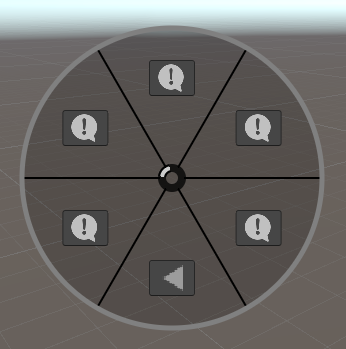

# Context Circle Menu

Context Circle Menu は、Sceneビュー上で円形のメニューを開き、任意のメソッドを直観的に実行できるツールです。開発効率を極限まで高めます。


[](LICENSE)


## 概要

Context Circle Menu はUnity用のシンプルなツールです。円形のメニューを開くことができるVisualElementを提供します。また、Sceneビュー上でメニューを開くローダー機能を搭載しています。このメニューは円形にボタンが広がるため少ないマウス操作と直観的な理解で任意のメソッドを実行させることができます。開発効率を極限まで高まることが期待できます。

[](https://gyazo.com/8124142a3643fb0d735f7dd66b068142)

[](https://gyazo.com/8256a41b2b0f7f73d98e6f6af0f94479)

### 特徴

-   円形メニューの作成
-   使いやすいエディターアイコン
-   メニューのカスタマイズ
    -   アトリビュートからメソッドを追加
    -   手動でメソッドを追加
    -   ボタンのデザイン
    -   フォルダーのデザイン
-   Sceneビュー上でメニューを開く
-   ショートカットキーのカスタマイズ

## 目次
- [Context Circle Menu](#context-circle-menu)
  - [概要](#概要)
    - [特徴](#特徴)
  - [目次](#目次)
  - [セットアップ](#セットアップ)
    - [要求](#要求)
    - [インストール](#インストール)
  - [デモ](#デモ)
    - [Editor Icons](#editor-icons)
    - [手動メソッド追加](#手動メソッド追加)
  - [カスタマイズ](#カスタマイズ) 
    - [ボタンのカスタマイズ](#ボタンのカスタマイズ)
    - [フォルダのカスタマイズ](#フォルダのカスタマイズ)
    - [ショートカットキーのカスタマイズ](#ショートカットキーのカスタマイズ)
  - [API ドキュメント](#API ドキュメント)
  - [LISENCE](#lisence)
  - [AUTHOR](#author)

## セットアップ

### 要求

-   Unity 2022.3 以上

### インストール

1. Window > Package ManagerからPackage Managerを開く
2. 「+」ボタン > Add package from git URL
3. 以下を入力する

```
https://github.com/Garume/ContextCircleMenu.git?path=/Assets/ContextCircleMenu
```

あるいはPackages/manifest.jsonを開き、dependenciesブロックに以下を追記

```
{
    "dependencies": {
        "com.garume.context-circle-menu": "https://github.com/Garume/ContextCircleMenu.git?path=/Assets/ContextCircleMenu"
    }
}
```

## デモ

静的メソッドに `ContextCircleMenu` 属性を適用するだけで追加できます。

```cs
public class Menu
{
    [ContextCircleMenu("Debug Test")]
    public static void TestMethod()
    {
        Debug.Log("TestMethod");
    }
}
```

下図のようにメニューが作成されます。

メニューはSceneビュー上で`A`キーを押すことで開くことができます。

[](https://gyazo.com/1ec027f73700f52c6b3cd9691647a8a1)

フォルダを作りたい場合は、`/`で区切ってください。

```cs
public class Menu
{
    [ContextCircleMenu("Example/Debug Test")]
    public static void TestMethod()
    {
        Debug.Log("TestMethod");
    }
}
```

すると下図のようにフォルダ階層付きのメニューが作成されます。

[](https://gyazo.com/39b665e8fdd473bb408102e1b5d5bf09)

### Editor Icons

メニューボタンにアイコンを付けることができます。

アイコンを簡単に追加するためのユーティリティとして `EditorIcons` クラスが提供されています。

アイコンを追加するには、以下のようにしてください。

```cs
[ContextCircleMenu("Debug Test", EditorIcons.ConsoleInfoIcon)]
public static void TestMethod()
{
    Debug.Log("TestMethod");
}
```

### 手動メソッド追加

`Context Circle Menu` 属性を使用する以外に、手動で追加することもできます。

内部的にメソッドを登録するプロセスを`ContextCircleMenuLoader.OnBuild`でフックすることができます。これを利用して以下のように記述します。

```cs
public class Menu
{
    [InitializeOnLoadMethod]
    private static void Initialize()
    {
        ContextCircleMenuLoader.OnBuild += (builder =>
        {
            builder.AddMenu("Debug Test", EditorGUIUtility.IconContent(EditorIcons.ConsoleInfoIcon), () => Debug.Log("Debug Test"));
            builder.AddMenu("Instantiate/Cube", EditorGUIUtility.IconContent(EditorIcons.PreMatCube), ()=> GameObject.CreatePrimitive(PrimitiveType.Cube));
            builder.AddMenu("Instantiate/Sphere", EditorGUIUtility.IconContent(EditorIcons.PreMatSphere), ()=> GameObject.CreatePrimitive(PrimitiveType.Sphere));
        });
    }
}
```

## カスタマイズ


### ボタンのカスタマイズ

ボタンのUIが気に入らなければ、独自のボタンに置き換えることができます。

`ContextCircleMenuLoader.OnBuild`内で`builder.ConfigureButton`を使用してください。

```cs
ContextCircleMenuLoader.OnBuild += (builder =>
{
    ...
    builder.ConfigureButton(FolderMenuFactory);
});
```

独自のボタンを作成するためには、CircleButtonを継承したクラスとそれに対応したFactoryクラスを作成する必要があります。

ここでは、SampleのCustomで提供しているものと同様のコードを例として紹介します。

SampleはPackage Manager > ContextCircleMenu > Samplesからインポートすることができます。

この例では、アイコンのみ表示するボタンに置き換えています。

以下のクラスを作成してください。

```cs
public class CustomButtonFactory : IButtonFactory
{
    public CircleButton Create(string path, GUIContent icon, Action onSelected, int section)
    {
        return new OnlyImageCircleButton(path, icon, section, onSelected);
    }

    // フォルダ構造のメニューを作成する際に戻るボタンが必要です。
    // ConfigureFolderを利用しない限りsectionは-1にしてください。
    public CircleButton CreateBackButton(Action onBack)
    {
        return new OnlyImageCircleButton("Back", EditorGUIUtility.IconContent(EditorIcons.Back2x),
            -1, onBack);
    }
}

public class OnlyImageCircleButton : CircleButton
{
    public OnlyImageCircleButton(string text, GUIContent icon, int section, Action onSelect) : base(text, icon, section, onSelect)
    {
    }

    // 生成したボタンを編集することができます。
    // ここで自由にボタンをカスタマイズしてください。
    protected override void ModifierButton(Button button, string text, GUIContent icon, int section)
    {
        var image = new Image
        {
            image = icon.image,
            style =
            {
                width = 32f,
                height = 32f,
                flexShrink = 0
            },
            tooltip = text
        };

        button.Add(image);
    }
}

```

作成したFactoryクラスを設定します。

```cs
ContextCircleMenuLoader.OnBuild += (builder =>
{
    ...
    builder.ConfigureButton(new CustomButtonFactory());
});
```

すると以下のようにアイコンのみ表示するボタンに置き換わります。


### フォルダのカスタマイズ

フォルダのUIが気に入らなければ、独自のフォルダに置き換えることができます。

`ContextCircleMenuLoader.OnBuild`内で`builder.ConfigureFolder`を使用してください。

```cs
ContextCircleMenuLoader.OnBuild += (builder =>
{
    ...
    builder.ConfigureFolder(FolderMenuFactory);
});
```

> [!CAUTION]
> v1.0.0で破壊的な変更が加えられました。

独自のフォルダを作成するためには、FolderCircleMenuを継承したクラスとそれに対応したFactoryクラスを作成する必要があります。


ここでは、SampleのCustomで提供しているものと同様のコードを例として紹介します。

SampleはPackage Manager > ContextCircleMenu > Samplesからインポートすることができます。

この例では、既存のUIにベクターグラフィックスを加えたものに置き換えています。

以下のクラスを作成してください。

```cs
public class CustomFolderMenuFactory : IFolderCircleMenuFactory
{
    public FolderCircleMenu Create(string path, IMenuControllable menu, CircleMenu parent, IButtonFactory factory)
    {
        return new CustomFolderCircleMenu(path, menu, parent, factory);
    }
}

public class CustomFolderCircleMenu : FolderCircleMenu
{
    public CustomFolderCircleMenu(string path, IMenuControllable menu, CircleMenu parent, IButtonFactory factory) :
        base(path, menu, EditorGUIUtility.IconContent(EditorIcons.FolderIcon), parent, factory)
    {
    }

    protected override VisualElement[] CreateUtilityElements(ref ContextCircleMenuOption menuOption)
    {
        var element = new VisualElement();
        var option = menuOption;
        element.generateVisualContent += context =>
        {
            var painter = context.painter2D;
            var buttonCount = ButtonElements.Length;
            for (var i = 0; i < buttonCount; i++)
            {
                var angle = (float)i / buttonCount * 360f;
                if (buttonCount % 2 == 1)
                    angle += 180f;
                else
                    angle += 180f - 360f / buttonCount / 2;
                var vector = new Vector2(
                    Mathf.Sin(Mathf.Deg2Rad * angle),
                    Mathf.Cos(Mathf.Deg2Rad * angle)).normalized;

                var from = vector * 12f;
                var to = vector * option.Radius * 1.5f;
                painter.strokeColor = Color.black;
                painter.lineWidth = 2f;
                painter.BeginPath();
                painter.MoveTo(from);
                painter.LineTo(to);
                painter.Stroke();
            }

            painter.BeginPath();
            painter.Arc(Vector2.zero, option.Radius * 1.5f, 0, 360f);
            painter.fillColor = new Color(0f, 0f, 0f, 0.2f);
            painter.Fill();

            painter.DrawCircle(Vector2.zero, option.Radius * 1.5f, 0, 360f, 5f, Color.gray);
        };
        return new[] { element };
    }
}
```

作成したFactoryクラスを設定します。

```cs
ContextCircleMenuLoader.OnBuild += (builder =>
{
    ...
    builder.ConfigureButton(new CustomButtonFactory());
    builder.ConfigureFolder(new CustomFolderMenuFactory());
});
```

すると以下のようなUIに置き換わります。



### ショートカットキーのカスタマイズ

デフォルトのメニュー開閉ボタンは`A`キーに設定されていますが、自由に変更することができます。

まず`Edit > Shortcuts`でウィンドウを開いてください。

`Context Circle Menu`と検索すると、下図のような設定が見つかります。


好きなキーに設定してください。

## API ドキュメント

ここでは主要なAPIを説明します。UIをカスタマイズする際の参考にしてください。

### ContextCircleMenu

#### プロパティ
| プロパティ名 | 説明 |
| ---- | ---- |
| BlockMouseEvents | trueの場合にクリック等のマウス操作を無効化します |

#### メソッド
| メソッド名 | 説明 |
| ---- | ---- |
| Show() | メニューを表示します。 |
| Hide() | メニューを非表示にします。 |
| Open(CircleMenu menu) | 引数に指定したメニューを開きます。 |
| Back() | 前回のメニューを開きます。 |
| TryForceSelect() | フォーカスされているボタンがあれば強制的に選択します。 |
| TryForceEnterByMousePosition() | マウスの位置に対応するボタンを強制的にフォーカスします。 |
| CreateMenu(Action\<CircleMenuBuilder\> configureMenu) | メニュー内容をCircleMenuBuilderを用いて作成します。 |

### CircleMenuBuilder
#### メソッド
| メソッド名 | 説明 |
| ---- | ---- |
| AddMenu(ICircleMenuFactory factory) | 独自のメニューを追加します。 |
| AddMenu(string path, GUIContent content, Action action) | 手動でメニューを追加します。 |
| AddMenu(ContextCircleMenuAttribute attribute, MethodInfo method) | 属性からメニューを追加します。 |
| ConfigureFolder(IFolderCircleMenuFactory factory) | 独自のフォルダーメニューに置き換えます。 |
| ConfigureButton(IButtonFactory factory) | 独自のボタンに置き換えます。 |

### CircleMenu
#### 抽象メソッド
| メソッド名 | 説明 |
| ---- | ---- |
| CreateButtons(IButtonFactory factory, ref ContextCircleMenuOption menuOption) | メニューに表示するボタンを作成します。ここで渡されるIButtonFactoryはCircleMenuBuilder.ConfigureButton()で設定したものになります。 |

#### 仮想メソッド 
| メソッド名 | 説明 |
| ---- | ---- |
| CreateUtilityElements(ref ContextCircleMenuOption menuOption) | ボタン以外の要素を作成します。 |
| OnInitialized(ref ContextCircleMenuOption menuOption) | 初期化時に呼ばれます。 |
| OnBuild() | 要素作成時に呼ばれます。主にShow()やOpen()が呼ばれた時です。 |

### CircleButton
#### 抽象メソッド
| メソッド名 | 説明 |
| ---- | ---- |
| ModifierButton(Button button, string text, GUIContent icon, int section) | ボタン作成時に呼ばれます。ボタンの要素を編集するために用いてください。 |

#### 仮想メソッド 
| メソッド名 | 説明 |
| ---- | ---- |
| OnMouseEnter(Button button, MouseEnterEvent evt) | マウスが要素内に入った際に呼ばれます。|
| OnMouseLeave(Button button, MouseLeaveEvent evt) | マウスが要素内から出た際に呼ばれます。 |

## LISENCE

MIT

## AUTHOR

@Garume
