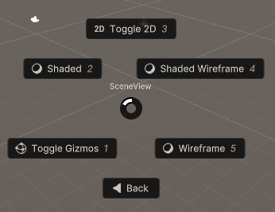
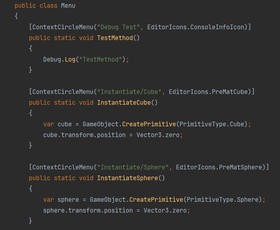
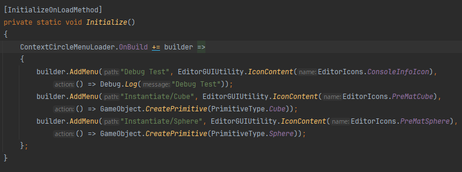
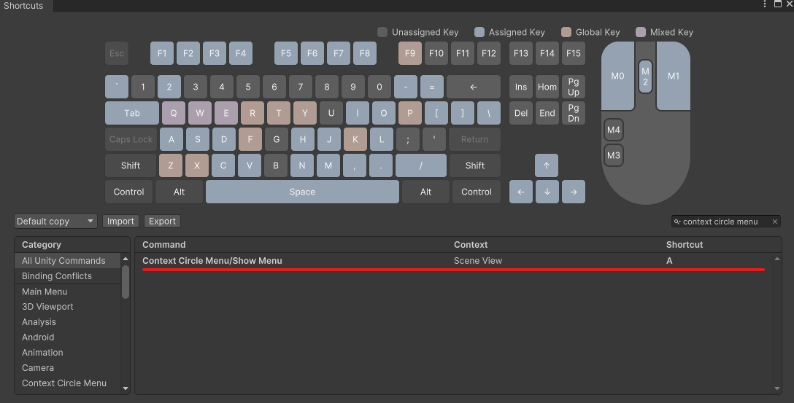

# Context Circle Menu

Context Circle Menu は、Sceneビュー上で円形のメニューを開き、任意のメソッドを直観的に実行できるツールです。開発効率を極限まで高めます。


[](LICENSE)


## 概要

Context Circle Menu はUnity用のシンプルなツールです。円形のメニューを開くことができるVisualElementを提供します。また、Sceneビュー上でメニューを開くローダー機能を搭載しています。このメニューにより、任意のメソッドを素早く使用することができます。円形にボタンが広がるため少ないマウス操作と直観的な理解で開発効率を極限まで高めることが可能です。

[](https://gyazo.com/8124142a3643fb0d735f7dd66b068142)

[](https://gyazo.com/8256a41b2b0f7f73d98e6f6af0f94479)

### 特徴

-   円形メニューの作成



-   使いやすいエディターアイコン

-   メニューのカスタマイズ

    -   アトリビュートからメソッドを追加

    

    -   手動でメソッドを追加

    

-   Sceneビュー上でメニューを開く
-   ショートカットキーのカスタマイズ



## 目次
- [Context Circle Menu](#context-circle-menu)
  - [概要](#概要)
    - [特徴](#特徴)
  - [目次](#目次)
  - [セットアップ](#セットアップ)
    - [要求](#要求)
    - [インストール](#インストール)
  - [デモ](#デモ)
  - [Editor Icons](#editor-icons)
  - [メニューのカスタマイズ](#メニューのカスタマイズ)
    - [手動メソッド追加](#手動メソッド追加)
    - [ボタンのカスタマイズ](#ボタンのカスタマイズ)
  - [ショートカットキーのカスタマイズ](#ショートカットキーのカスタマイズ)
  - [LISENCE](#lisence)
  - [AUTHOR](#author)

## セットアップ

### 要求

-   Unity 2022.3 以上

### インストール

1. Window > Package ManagerからPackage Managerを開く
2. 「+」ボタン > Add package from git URL
3. 以下を入力する

```
https://github.com/Garume/Context-Circle-Menu.git?path=/Assets/ContextCicleMenu
```

あるいはPackages/manifest.jsonを開き、dependenciesブロックに以下を追記

```
{
    "dependencies": {
        "com.garume.context-circle-menu": "https://github.com/Garume/Context-Circle-Menu.git?path=/Assets/ContextCicleMenu"
    }
}
```

## デモ

追加したい静的メソッドに `Context Circle Menu` 属性を適用するだけで追加できます。

```cs
public class Menu
{
    [ContextCircleMenu("Debug Test")]
    public static void TestMethod()
    {
        Debug.Log("TestMethod");
    }
}
```

すると下のようにメニューが作成されます。

Sceneビュー上で`A`キーを押すことでメニューを開けます。

[](https://gyazo.com/1ec027f73700f52c6b3cd9691647a8a1)

フォルダを作りたい場合は、`/`で区切ってください。

```cs
public class Menu
{
    [ContextCircleMenu("Example/Debug Test")]
    public static void TestMethod()
    {
        Debug.Log("TestMethod");
    }
}
```

すると下のようにメニューが作成されます。

[](https://gyazo.com/39b665e8fdd473bb408102e1b5d5bf09)

## Editor Icons

メニューボタンにアイコンを付けることができます。

アイコンを簡単に追加するためのユーティリティとして `EditorIcons` クラスが提供されています。

アイコンを追加するには、以下のようにしてください。

```cs
[ContextCircleMenu("Debug Test", EditorIcons.ConsoleInfoIcon)]
public static void TestMethod()
{
    Debug.Log("TestMethod");
}
```

## メニューのカスタマイズ

### 手動メソッド追加

もし `Context Circle Menu` 属性を使いたくない場合は、手動でメソッドを登録することができます。

内部的にメソッドを登録するプロセスを`ContextCircleMenuLoader.OnBuild`でフックすることができます。

```cs
public class Menu
{
    [InitializeOnLoadMethod]
    private static void Initialize()
    {
        ContextCircleMenuLoader.OnBuild += (builder =>
        {
            builder.AddMenu("Debug Test", EditorGUIUtility.IconContent(EditorIcons.ConsoleInfoIcon), () => Debug.Log("Debug Test"));
            builder.AddMenu("Instantiate/Cube", EditorGUIUtility.IconContent(EditorIcons.PreMatCube), ()=> GameObject.CreatePrimitive(PrimitiveType.Cube));
            builder.AddMenu("Instantiate/Sphere", EditorGUIUtility.IconContent(EditorIcons.PreMatSphere), ()=> GameObject.CreatePrimitive(PrimitiveType.Sphere));
        });
    }
}
```

### ボタンのカスタマイズ

ボタンのUIが気に入らなければ、独自のボタンに置き換えることができます。

`builder.ConfigureFolder();`を使ってください。

> [!CAUTION]
> これは未完成の機能です。
> 
> 破壊的な変更が加えられる可能性があります。

まず、`CircleMenu`を継承したFolderMenuを作成します。
独自のボタンは `CreateButtons` を通して自由に作成してください。
詳しいコードは `FolderCircleMenu.cs` を参照してください。

次に `IFolderCircleMenuFactory` を実装した FolderMenuFactory を作成します。
詳しいコードは `CircleMenuFactory` を参照してください。

最後に、以下のようにすることでUIの置き換えが完了します。

```cs
ContextCircleMenuLoader.OnBuild += (builder =>
{
    ...
    builder.ConfigureFolder(FolderMenuFactory);
});
```

## ショートカットキーのカスタマイズ

デフォルトのメニュー開閉ボタンは`A`キーに設定されていますが、自由に変更することができます。

まず`Edit > Shortcuts`でウィンドウを開いてください。

`Context Circle Menu`と検索すると、下図のような設定が見つかります。


好きなキーに設定してください。

## LISENCE

MIT

## AUTHOR

@Garume
